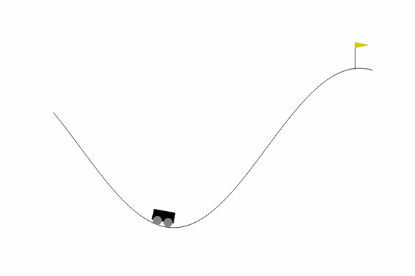

# Reinforcement Learning

This repository consists of Studies in Reinforcement Learnin.

## Environment and Libraries

One is adivised to create a virtual environment for running and reproducing the results. See [Python venv](https://docs.python.org/3/library/venv.html) for details.

Also, we've used the Python [Gymnasium library](https://pypi.org/project/gymnasium/) library, with the [Classic Control](https://gymnasium.farama.org/environments/classic_control/) environment. Also, some Numerical and Neural Network libraries were used.

For simplicity, see the `requirements.txt` for a detailed description of the necessary libraries.

## Running Examples

In the `examples` folder, one can find some of the working code examples:
 * `gymnasium_mountain_car_discrete_q_learning`: implements a solutin for the [Mountain Car Discrete](https://gymnasium.farama.org/environments/classic_control/mountain_car/) problem, using tabular Q-Learning;
 * `gymnasium_mountain_car_continuous_q_learning`: implements a solutin for the [Mountain Car Continuous](https://gymnasium.farama.org/environments/classic_control/mountain_car_continuous/) problem, using discretization of action space and tabular Q-Learning;
 * `gymnasium_mountain_car_continuous_reinforce`: implements a solutin for the [Mountain Car Continuous](https://gymnasium.farama.org/environments/classic_control/mountain_car_continuous/) problem, using a Monte-Carlo REINFORCE method, with a normal parametrization of the policies, where the parameter (mu, var) are given by Neural Networks.
 * `gymnasium_mountain_car_continuous_DDPG`: implements a solutin for the [Mountain Car Continuous](https://gymnasium.farama.org/environments/classic_control/mountain_car_continuous/) problem, using a Deep Deterministic Policy Gradient (DDPG) with a normal parametrization of the policies, where the parameter (mu, var) are given by Neural Networks.
 
Inside each folder is a running `*.py` file, responsible for the training, generating the plots and running a final sample.

## Results

## References

 * Seyde, T. et all (2021). [Is Bang-Bang Control All You Need? Solving Continuous Control with Bernoulli Policies.](https://arxiv.org/abs/2111.02552)
 * Sutton, R. S., Barto, A. G. (2018 ). _Reinforcement Learning: An Introduction_. The MIT Press.
 * Lapan, M. (2018). _Deep Reinforcement Learning Hands-On_. Birmingham, UK: Packt Publishing. ISBN: 978-1-78883-424-7
 * 

## Usefull Links>

 * [Gymnasium](https://gymnasium.farama.org/) environment
 * [Mountain Car Discrete](https://gymnasium.farama.org/environments/classic_control/mountain_car/) problem
 * [Mountain Car Contunuous](https://gymnasium.farama.org/environments/classic_control/mountain_car_continuous/) problem
 * Python [Gymnasium library](https://pypi.org/project/gymnasium/)
 * Python [virtual environment](https://docs.python.org/3/library/venv.html)
 * Gymnasium [Classic Control](https://gymnasium.farama.org/environments/classic_control/)
 * 

